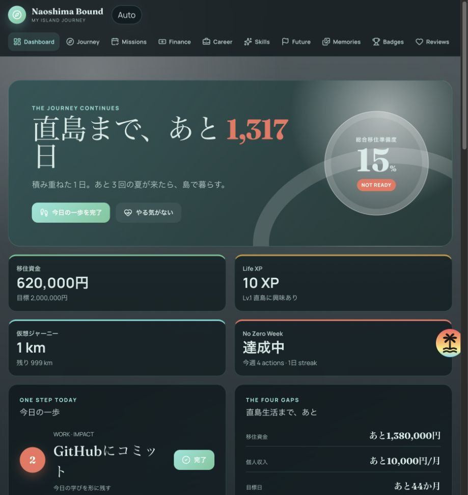
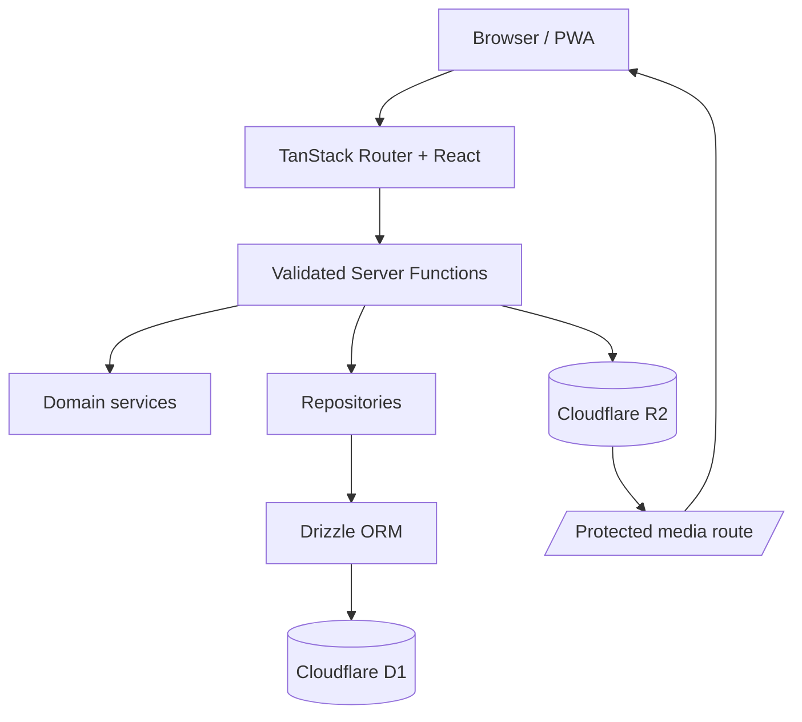

# Naoshima Bound

直島への移住を実現するまでの「今日の行動 → 移住条件の達成 → 資金の準備 → 月次振り返り」を一本につなぐ、個人用フルスタックWebアプリです。機能を絞ったLean版では、毎日使う操作だけを表示します。

初期版は1ユーザー・認証なしです。AI、物件／求人検索、SNS、他ユーザーランキング、通知、課金、広告は含みません。

## スクリーンショット



## 主な機能

- ホーム: 移住日カウントダウン、準備度、資金、今日の行動、最新／お気に入り写真
- 行動: Daily／Monthly／Yearly Missionの登録と完了
- 移住計画: 移住条件とロードマップ
- 資金: 現在額・目標額・入出金履歴・達成予測
- 思い出: 訪問記録、R2写真、短い思い出
- 振り返り: 月次Review、準備度・資金・完了行動のSnapshot
- 設定: 移住目標日などの基本値
- PWA manifestとService Worker

<!-- FEATURE_ARCHIVE_BEGIN: 旧フル機能一覧
- 移住日カウントダウン、移住準備度、Ready判定、仮想1,000km Journey、Life XP
- Daily／Monthly／Yearly Mission、Impact Score、今週の最優先、Minimum Mission、No Zero Week
- 移住条件とロードマップ、逆算カレンダー、レーダー、Milestone、Season／Focus Goal
- 移住資金、入出金履歴、達成予測、What-if、シナリオ比較、生活費／自由資金シミュレーション
- Career条件、収入源マップ、副収入Challenge、仕事独立度、Skill Tree
- 理想の一日／一週間、Future Diary、100 Dreams、未来プロフィール、手紙、タイムカプセル
- 訪問・場所・思い出マップ、R2写真／音声、アルバム、図鑑、季節、Bingo、Quest、写真比較
- Action History、Achievement自動解除、月次Review、Before／After、Score History、Journey Replay
- ホーム／ロック画面向けWidget
FEATURE_ARCHIVE_END -->

## 無効化した機能と復活方法

Lean版では以下を画面・ナビゲーション・通常のデータ取得経路から外しています。コード、DBテーブル、既存データは削除していません。

| 分類                 | 無効化した機能                                                                                         | 保存場所                                                                                           |
| -------------------- | ------------------------------------------------------------------------------------------------------ | -------------------------------------------------------------------------------------------------- |
| 独立画面             | Todo、仕事、スキル、未来、称号、PWAカウントダウンWidget                                                | `src/routes/todos.tsx`、`career.tsx`、`skills.tsx`、`future.tsx`、`achievements.tsx`、`widget.tsx` |
| ゲーミフィケーション | Life XP、Skill XP、仮想Journey、称号、連続行動、No Zero Week、ヒートマップ、Impact、Minimum Mission    | `src/routes/index.tsx`、`missions.tsx`、`src/server/core-repository.server.ts`                     |
| 移住計画             | 節目タイムライン、原点、季節目標、集中モード、記念日、決断・捨てる目標、時間・金額投資ログ             | `src/routes/journey.tsx`                                                                           |
| 資金                 | グラフ、生活シミュレーター、移住シナリオ比較、固定費削減、自由資金・1日コスト、移住日スライダー        | `src/routes/finance.tsx`                                                                           |
| 思い出               | 地図・お気に入り地点、音声、次回訪問計画、複数アルバム、図鑑、季節、カレンダー、Bingo、Quest、写真比較 | `src/routes/memories.tsx`                                                                          |
| 振り返り             | XP集計、グラフ、Journey Replay、移住日記、気持ちログ、移住理由履歴、迷ったときカード                   | `src/routes/reviews.tsx`                                                                           |
| 設定                 | Cloudflare接続表示、全データJSON出力、Widgetリンク                                                     | `src/routes/settings.tsx`                                                                          |
| サーバー集約         | 全機能を一括取得する旧`getDashboard`                                                                   | `src/server/dashboard.functions.ts`                                                                |

無効化したソースは各ファイルの `FEATURE_ARCHIVE_BEGIN` と `FEATURE_ARCHIVE_END` の間にコメントとして保存しています。独立画面は先頭のリダイレクトだけが有効です。

復活手順:

1. 対象ルートの先頭にあるLean実装またはリダイレクトをコメントアウトする。
2. 同ファイルの `FEATURE_ARCHIVE_BEGIN/END` マーカーを外し、保存された旧実装を有効にする。
3. `src/components/Header.tsx` の同名ナビゲーションとアイコンimportをコメント解除する。
4. 旧ダッシュボードが必要な場合は、`src/server/dashboard.functions.ts` のLeanローダー群をコメントアウトし、保存された旧`getDashboard`ブロックを有効にする。
5. XP・Skill XP・称号も戻す場合は、Mission画面を旧実装へ戻す。旧画面は`completeMission`／`uncompleteMission`を使うため、旧処理へ自動的に戻る。
6. `pnpm generate-routes && pnpm check`を実行する。

Lean版の利用中はMission完了でXP・Skill XP・称号を更新しません。また、Lean版で作る月次Snapshotの`totalXp`は`0`、`skillLevels`は空になります。既存のXP・Skill・称号・未来・音声・各種ログ・R2オブジェクトは変更も削除もしません。

## データ取得の軽量化

旧`getDashboard`は21の集約データソースに加えて、Career、称号、訪問場所、14種類の追加リソースを内部で取得していました。Lean版は画面ごとにServer Functionを分けています。

| 画面     | 通常ロード時の主要取得                                   |
| -------- | -------------------------------------------------------- |
| ホーム   | 設定・移住条件・Mission・資金設定・直近の入出金（5系統） |
| 移住計画 | 設定・移住条件・ロードマップ（3系統）                    |
| 行動     | Mission（1系統）                                         |
| 資金     | 資金設定・直近の入出金（2系統）                          |
| 思い出   | 件数上限付きの訪問・思い出・写真（3系統）                |
| 振り返り | 月次Review・Snapshot（2系統）                            |
| 設定     | 基本設定（1系統）                                        |

入出金は直近100件、訪問は50件、思い出は100件、写真は60件に通常表示を制限しています。全件取得メソッドは旧機能の復活用として残しています。

ホームの写真は、D1からお気に入り優先の代表写真メタデータを1件だけ取得します。画像本体はブラウザが表示時に保護メディアルートからR2へ取りに行き、ホームでは表示領域を確保した優先画像、思い出一覧では遅延読込を使います。写真の追加・お気に入り変更は「思い出」画面から行えます。

## Technology

- TanStack Start / TanStack Router / React / TypeScript
- TanStack Start Server Functions + Zod
- Cloudflare Workers / D1 / R2
- Drizzle ORM / drizzle-kit
- Tailwind CSS v4 + application CSS
- Recharts / Leaflet / React Leaflet / date-fns / lucide-react
- Vitest / Testing Library / ESLint / Prettier
- pnpm

## Architecture



構造化データとメディアのメタデータはD1、画像・音声本体はR2へ保存します。メディア削除ではD1レコードとR2オブジェクトの両方を削除します。Leafletはクライアント側でのみ遅延ロードされます。

## Setup

前提: Node.js 22以上、pnpm 10、Cloudflareアカウント。

```bash
pnpm install
pnpm exec wrangler login
pnpm exec wrangler d1 create naoshima-bound
pnpm exec wrangler r2 bucket create naoshima-bound-photos
```

`wrangler d1 create` が返す `database_id` を `wrangler.jsonc` の仮ID `00000000-0000-0000-0000-000000000000` と置き換えてください。R2名を変更した場合は同ファイルの `bucket_name` も合わせます。

## Environment Variables

Cloudflare Workers上のアプリは `wrangler.jsonc` の `DB` と `PHOTOS` Bindingを利用するため、実行時の `DATABASE_URL` は不要です。

Drizzle StudioなどD1 HTTP APIを直接使う開発ツール向けに、必要な場合だけ次を設定します。

```bash
cp .env.example .env
```

```env
CLOUDFLARE_ACCOUNT_ID=
CLOUDFLARE_DATABASE_ID=
CLOUDFLARE_D1_TOKEN=
```

ローカル専用Secretは `.dev.vars.example` を `.dev.vars` にコピーして追加できます。`.env*` と `.dev.vars*` は例示ファイル以外Git管理されません。

## Database Migration

ローカルD1:

```bash
pnpm db:migrate
```

Cloudflare上のD1:

```bash
pnpm db:migrate:remote
```

スキーマ変更後のmigration生成:

```bash
pnpm db:generate
```

## 開発用サンプルデータ

ローカルで画面を確認する場合に限り、開発用サンプルデータを投入できます。Cloudflare上の本番D1へ投入するコマンドは用意していません。本番ではアプリの「設定」を起点に、必要なデータを自分で登録してください。

```bash
pnpm db:seed
```

## Development

```bash
pnpm dev
```

[http://localhost:3000](http://localhost:3000) を開きます。R2 BindingもWranglerのローカルストレージへ接続され、アップロードファイルを `public/` やD1 BLOBへ永続化しません。

## Test

```bash
pnpm test
pnpm lint
pnpm typecheck
pnpm format:check
```

Unit Testは準備度、Journey、XP、資金予測、生活シミュレーション、Achievement、行動洞察、日の出／日の入りを対象にしています。Mission完了のIntegration Testでは、実際のmigrationを適用したインメモリSQLiteに対し、Mission更新・XP Transaction・Action Log・Skill XPが同じバッチで反映されることを確認します。

すべてをまとめて検証する場合:

```bash
pnpm check
```

## Build

```bash
pnpm build
```

出力はCloudflare Workers向けに生成されます。デプロイ前にD1/R2を作成し、`wrangler.jsonc` の本番Bindingを設定してください。

```bash
pnpm deploy
```

## Data notes

- 写真: 10MB以下、音声: 50MB以下。MIME typeをServer Functionで検証します。
- タイムカプセルの文章・R2メディアは開封日までレスポンス上でも隠します。
- 月次Review保存時に、その月の準備度・資金・XP・完了Mission・Skill LevelのSnapshotを記録します。
- 秘密情報をリポジトリへコミットしないでください。
