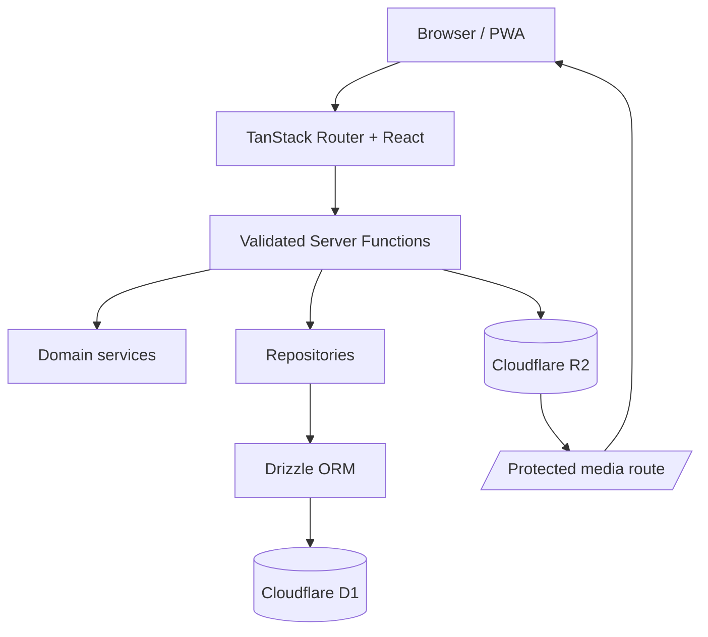

# Naoshima Bound

直島への移住を実現するまでの「今日の行動 → 成長 → 移住条件の達成 → 直島に近づく」を一本につなぐ、個人用フルスタックWebアプリです。TODOを消化するだけでなく、Mission、Life XP、スキル、移住資金、働き方、未来設計、訪問と思い出を同じダッシュボードで可視化します。

初期版は1ユーザー・認証なしです。AI、物件／求人検索、SNS、他ユーザーランキング、通知、課金、広告は含みません。

## スクリーンショット


## 主な機能

- 移住日カウントダウン、移住準備度、Ready判定、仮想1,000km Journey、Life XP
- Daily／Monthly／Yearly Mission、Impact Score、今週の最優先、Minimum Mission、No Zero Week
- 移住条件とロードマップ、逆算カレンダー、レーダー、Milestone、Season／Focus Goal
- 移住資金、入出金履歴、達成予測、What-if、シナリオ比較、生活費／自由資金シミュレーション
- Career条件、収入源マップ、副収入Challenge、仕事独立度、Skill Tree
- 理想の一日／一週間、Future Diary、100 Dreams、未来プロフィール、手紙、タイムカプセル
- 訪問・場所・思い出マップ、R2写真／音声、アルバム、図鑑、季節、Bingo、Quest、写真比較
- Action History、Achievement自動解除、月次Review、Before／After、Score History、Journey Replay
- PWA manifest、Service Worker、ホーム／ロック画面向けWidget

## Technology

- TanStack Start / TanStack Router / React / TypeScript
- TanStack Start Server Functions + Zod
- Cloudflare Workers / D1 / R2
- Drizzle ORM / drizzle-kit
- Tailwind CSS v4 + application CSS
- Recharts / Leaflet / React Leaflet / date-fns / lucide-react
- Vitest / Testing Library / ESLint / Prettier
- pnpm

## Architecture



構造化データとメディアのメタデータはD1、画像・音声本体はR2へ保存します。メディア削除ではD1レコードとR2オブジェクトの両方を削除します。Leafletはクライアント側でのみ遅延ロードされます。

## Setup

前提: Node.js 22以上、pnpm 10、Cloudflareアカウント。

```bash
pnpm install
pnpm exec wrangler login
pnpm exec wrangler d1 create naoshima-bound
pnpm exec wrangler r2 bucket create naoshima-bound-photos
```

`wrangler d1 create` が返す `database_id` を `wrangler.jsonc` の仮ID `00000000-0000-0000-0000-000000000000` と置き換えてください。R2名を変更した場合は同ファイルの `bucket_name` も合わせます。

## Environment Variables

Cloudflare Workers上のアプリは `wrangler.jsonc` の `DB` と `PHOTOS` Bindingを利用するため、実行時の `DATABASE_URL` は不要です。

Drizzle StudioなどD1 HTTP APIを直接使う開発ツール向けに、必要な場合だけ次を設定します。

```bash
cp .env.example .env
```

```env
CLOUDFLARE_ACCOUNT_ID=
CLOUDFLARE_DATABASE_ID=
CLOUDFLARE_D1_TOKEN=
```

ローカル専用Secretは `.dev.vars.example` を `.dev.vars` にコピーして追加できます。`.env*` と `.dev.vars*` は例示ファイル以外Git管理されません。

## Database Migration

ローカルD1:

```bash
pnpm db:migrate
```

Cloudflare上のD1:

```bash
pnpm db:migrate:remote
```

スキーマ変更後のmigration生成:

```bash
pnpm db:generate
```

## Seed

開発用Seedには、2030-04-01の移住目標、6カテゴリの条件、Mission、Skill、資金、Career、未来の生活、訪問、Achievementなど、主要画面を確認できる代表データが入っています。`INSERT OR IGNORE` のため再実行できます。

```bash
pnpm db:seed
```

リモートD1へ投入する場合:

```bash
pnpm db:seed:remote
```

## Development

```bash
pnpm dev
```

[http://localhost:3000](http://localhost:3000) を開きます。R2 BindingもWranglerのローカルストレージへ接続され、アップロードファイルを `public/` やD1 BLOBへ永続化しません。

## Test

```bash
pnpm test
pnpm lint
pnpm typecheck
pnpm format:check
```

Unit Testは準備度、Journey、XP、資金予測、生活シミュレーション、Achievement、行動洞察、日の出／日の入りを対象にしています。Mission完了のIntegration Testでは、実際のmigrationを適用したインメモリSQLiteに対し、Mission更新・XP Transaction・Action Log・Skill XPが同じバッチで反映されることを確認します。

すべてをまとめて検証する場合:

```bash
pnpm check
```

## Build

```bash
pnpm build
```

出力はCloudflare Workers向けに生成されます。デプロイ前にD1/R2を作成し、`wrangler.jsonc` の本番Bindingを設定してください。

```bash
pnpm deploy
```

## Data notes

- 写真: 10MB以下、音声: 50MB以下。MIME typeをServer Functionで検証します。
- タイムカプセルの文章・R2メディアは開封日までレスポンス上でも隠します。
- 月次Review保存時に、その月の準備度・資金・XP・完了Mission・Skill LevelのSnapshotを記録します。
- 秘密情報をリポジトリへコミットしないでください。
